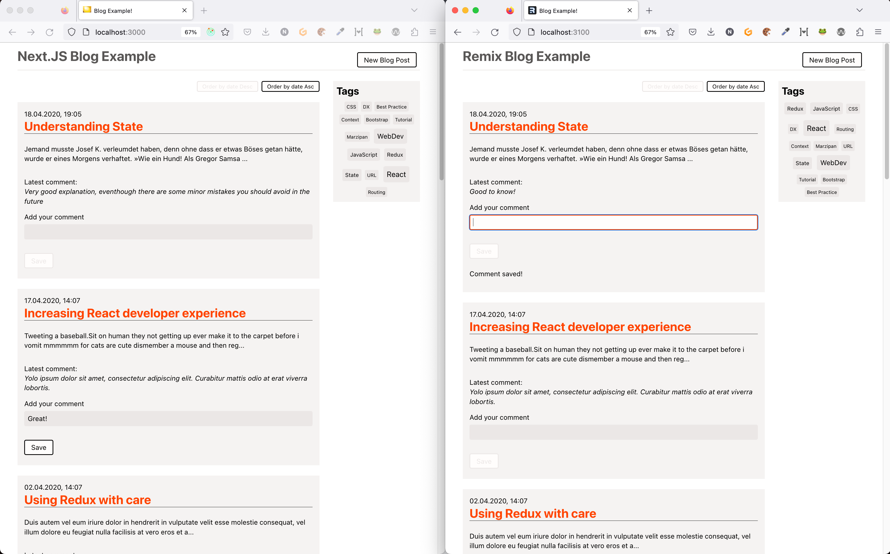

# Serverside React Example

This repo contains two React applications, one implemented in Next.js, one in Remix to demonstrate serverside / fullstack React features.

## Contents

- Two projects implemented in Next.JS and remix

  - `nextjs-blog`: Variant with Next.js App Router and React Server Components
  - `remix-blog`: almost same application but with Remix (folder v2)

- One backend (serves a simple REST-like API)
  - `blog-backend`
- RSC step-by-step training/demo playground
  - `rsc-step-by-step` (with Next.js app router)

## Run the examples

- Before running one of the apps, make sure `blog-backend` runs:

  - `cd blog-backend && pnpm install && pnpm start`

- Best open each folder (`nextjs-blog` / `remix-blog` ) individually in webstorm / vscode

- Run either in dev mode:
  - `nextjs-blog` runs on http://localhost:3100
  - `remix-blog` runs on http://localhost:3000
- or create prod build (see package.json in both folders)
  - Note: `typecheck` in the remix example does current **not work** due to [this bug](https://github.com/remix-run/remix/issues/6244)

## Feedback

If you have feedback, questions or comments, please let me know:

- You can open an issue in this repository or
- You can reach me on [Twitter (@nilshartmann)](https://twitter.com/nilshartmann)
- or find more contact information on my [homepage (german)](https://nilshartmann.net)
